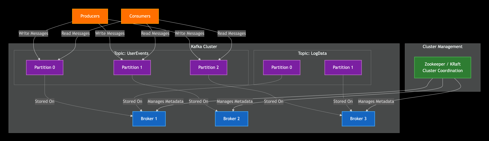

# Commontly used API types are mainly as below:

## Request-Response APIs

| API Type          | Example URL                         | Usage Case                      |
| ----------------- | ----------------------------------- | ------------------------------- |
| Path Parameter    | `/users/42`                         | Identify specific resource      |
| Query Parameter   | `/search?keyword=golang&page=2`     | Filters, sorting, pagination    |
| Matrix Parameter  | `/products;color=red;size=large`    | Extra metadata in path (rare)   |
| Subdomain         | `https://api.customer1.localhost:8080` | Multi-tenant SaaS, routing      |
| RESTful Hierarchy | `/users/42/orders`                  | Parent-child resource relations |

## Event Driven APIs

The detailed explanation of four key technologies used to build Event-Driven APIs (EDAs) as follows:

- **Apache Kafka (Event Streaming/Distributed Commit Log)**
- **Redis Pub/Sub (In-Memory Messaging)**
- **Webhooks (HTTP Callback)**
- **MQTT (Lightweight IoT Protocol)**

### Apache Kafka (Event Streaming/Distributed Commit Log)
Kafka is a **distributed event streaming platform** designed for high-throughput, fault-tolerant data pipelines and real-time streaming applications. It functions as a durable, highly scalable message bus.

#### Architecture
A Kafka Cluster consists of multiple Brokers (servers). Data is organized into Topics, which are partitioned across the brokers. Zookeeper (or KRaft in newer versions) manages the cluster state.

**Kafka Cluster Architecture**

**Kafka Cluster Detailed Version**

#### Data Structure
Data is stored as an ordered, immutable sequence of records called an Event Log. Each record within a partition is assigned a unique, sequential ID called an Offset.

#### Flow of Execution
1. **Producer** uses the Kafka Producer API to write a record to a specified **Topic** (often with a key to ensure records go to the same **Partition**). 
2. **Broker** receives the record and appends it to the end of the specified Topic Partition's log file on disk.
3. Consumer belongs to a Consumer Group and uses the Consumer API to pull records from one or more assigned partitions, keeping track of the last processed record's Offset. 
4. The message remains durable on the broker according to retention policies (e.g., 7 days), allowing new consumers or failed consumers to replay data from any offset.

**Kafka Messages Flow**

#### Key Feature
- **Durability (Messages Saved to Disk)**
Kafka persists all messages to disk immediately and replicates across multiple brokers, ensuring data survives hardware failures, power outages, and system crashes. Messages are not kept in memory only, they're physically written to disk with configurable replication factors (typically 3x).

- **Replayability**
Consumers can independently re-read any portion of the message stream by resetting their offset position. This enables:
